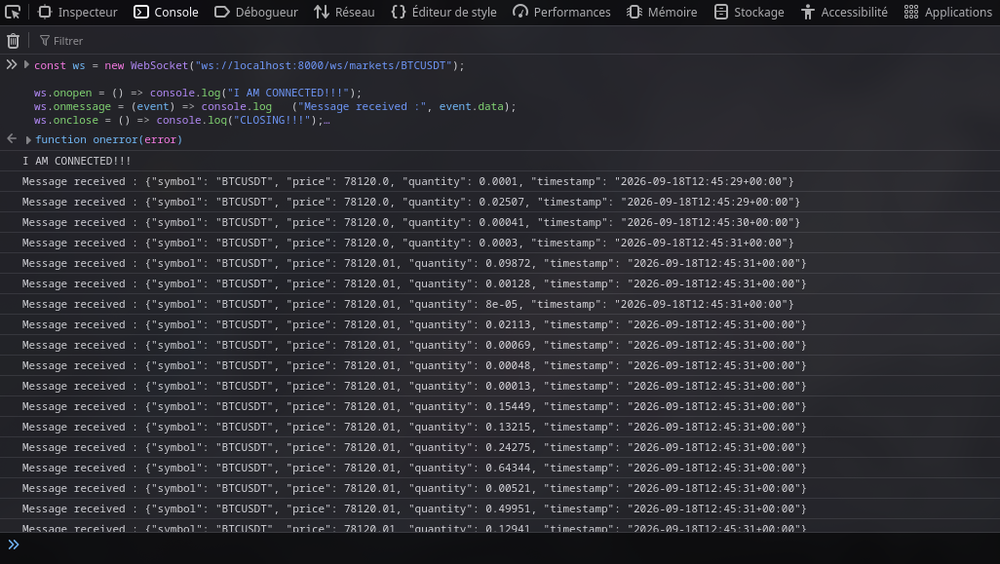
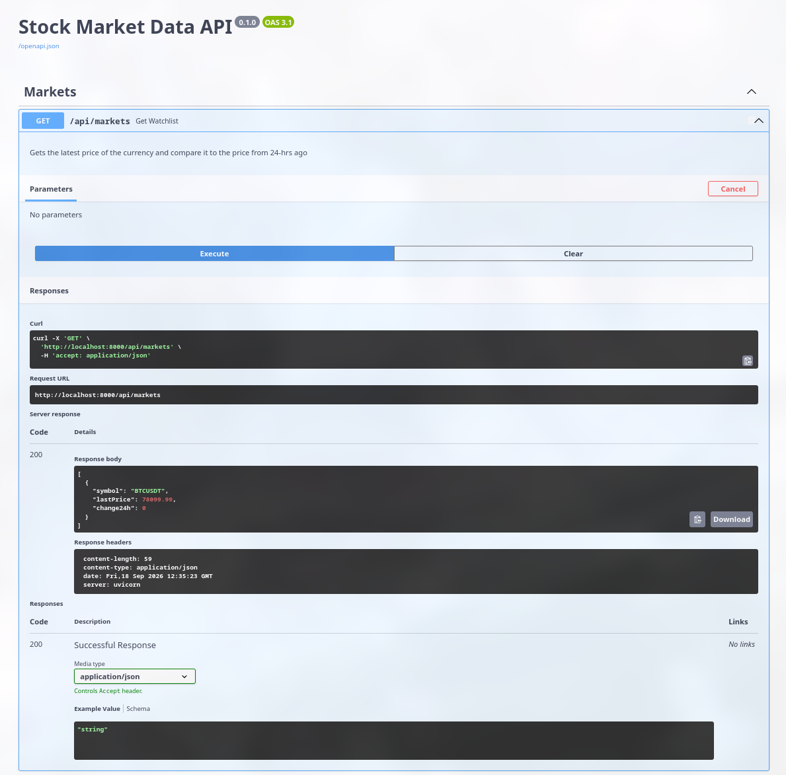

# API Server Backend

This service acts as the interface between the ingestion layer and the frontend. It provides the market data needed by the user interface through both HTTP endpoints and real-time WebSocket streaming, while keeping the presentation layer decoupled from the underlying Redis and PostgreSQL systems.

## Stack

The API server is built with:

- FastAPI for the web application and routing
- SQLAlchemy with asynchronous PostgreSQL access
- Redis Pub/Sub for live market updates
- WebSockets for broadcasting streaming data to frontend clients
- Pydantic-based validation models for structured API responses

This stack is designed to support both:

- live market updates for the frontend dashboard;
- historical candle and watchlist data for charts and market summaries.

## How the structure works

The application is organized around a few clear responsibilities:

- `main.py`: initializes app startup, creates the Redis client, and subscribes to the message channel
- `config.py`: loads environment variables and builds the connection URLs used by Redis and PostgreSQL
- `routers/markets.py`: provides the watchlist and candles routes
- `routers/websockets.py`: handles client WebSocket connections
- `utils/connection_manager.py`: manages connected clients and broadcasts messages
- `database/`: contains the async database session and ORM models

The end-to-end flow is straightforward:

1. The ingestion layer publishes market updates to Redis.
2. The API server subscribes to that Redis channel during startup.
3. Incoming messages are forwarded to all active WebSocket clients.
4. The frontend consumes live data through `/ws/markets/{symbol}`.
5. Historical and aggregated values are served through HTTP endpoints from PostgreSQL.

## Application startup and async lifespan

The server uses an asynchronous `lifespan` context manager in `main.py` to initialize everything required before FastAPI begins serving requests.

This pattern is important because it ensures the application is fully configured before the server starts accepting client traffic. The lifecycle works like this:

- create a Redis connection pool from the URL built in `config.py`;
- create a Redis client bound to that pool;
- subscribe to the Redis channel used by the data producer (`market_ticks_channel`);
- start a background listener task that waits for incoming messages;
- `yield` control to FastAPI so the app can handle HTTP/WebSocket requests;
- on shutdown, cancel the listener task and properly close the Redis pool.

This design lets the API be ready for real-time streaming as soon as it starts, without repeated per-request connection setup.

### Redis listening task

Inside the lifespan hook, the API creates a `redis_listener()` coroutine that subscribes to the channel and waits for messages:

```python
pubsub = redis_client.pubsub()
await pubsub.subscribe("market_ticks_channel")
```

Then, for each incoming Redis message:

```python
if message and message["type"] == "message":
    data = message["data"]
    await manager.broadcast(message=data)
```

This is the critical bridge between the Redis publisher and the frontend. The service listens to the live stream and forwards each message to all connected users in real time.

## WebSocket connection manager

The WebSocket logic is centralized in `utils/connection_manager.py`.

The `ConnectionManager` class is responsible for:

- accepting client connections;
- storing active WebSocket sessions;
- removing disconnected clients;
- broadcasting one Redis message to every connected client.

The implementation keeps a set of active sockets:

```python
class ConnectionManager:
    def __init__(self):
        self.active_connections: Set[WebSocket] = set()
```

When a browser connects to `/ws/markets/{symbol}`, the server accepts the socket and adds it to this set. Then every Redis message is sent to each connected client using `broadcast()`.

This avoids polling and provides a clean push-based update model for the frontend.

## WebSocket route

The WebSocket endpoint is defined in `routers/websockets.py`:

```python
@router.websocket("/markets/{symbol}")
async def ws_market_data(websocket: WebSocket):
    await manager.connect(websocket)
    try:
        while True:
            await websocket.receive_text()
    except WebSocketDisconnect:
        manager.disconnect(websocket)
```

This endpoint keeps the WebSocket alive while the client is connected. It does not compute the market data itself; it acts as a live relay between Redis and the frontend browser.

## REST API for market data

The REST layer in `routers/markets.py` is split between two core endpoints.

### Watchlist endpoint

The `GET /api/markets` route fetches the latest price for each tracked symbol and compares it with the price from 24 hours earlier.

For each symbol, the function:

- selects the most recent tick price;
- selects the oldest tick in the last 24-hour window;
- calculates the percentage change;
- returns the result in JSON for the frontend watchlist.

At the moment, the project currently tracks a single currency, but the structure is ready to expand to multiple symbols without changing the overall design.

### Candle endpoint

The `GET /api/markets/{symbol}/candles` route retrieves historical OHLC data from the `market_candles` table.

The route accepts:

- `symbol`: the asset symbol (for example `BTCUSDT`)
- `interval`: the candle interval (`1m`, `5m`, `1h`, etc.)
- `limit`: the number of candles to return

The query selects the matching records from PostgreSQL, orders them by time, and returns them in chronological order for chart rendering.

This is the endpoint the frontend uses so it can draw the market graph using the open/high/low/close values from the candle dataset.

## Data flow in practice

The full architecture is:

1. Market data is ingested and published to Redis.
2. The API server subscribes to the Redis channel at startup.
3. Redis messages are received by the background listener.
4. The listener broadcasts the payload to all connected WebSocket clients.
5. The frontend receives live updates through the WebSocket.
6. The REST API reads structured data from PostgreSQL for watchlist and historical candle requests.

This separation is useful because:

- live updates are streamed in real time through WebSockets;
- historical data is read from the database in a structured way;
- Redis acts as the event layer between ingestion and presentation.

## Debug and testing

### WebSocket validation

To confirm that the socket is working, inspect the API logs:

```bash
podman logs -f transcendence_api_server
```

Then open the app in a browser and run:

```js
const ws = new WebSocket("ws://localhost:8000/ws/markets/BTCUSDT"); // You can replace BTCUSDT by other currency

ws.onopen = () => console.log("Connected!");
ws.onmessage = (event) => console.log("Message received:", event.data);
ws.onclose = () => console.log("Closing...");
ws.onerror = (error) => console.log("ERROR:", error);
```

If the ingestion service is publishing to Redis and the API server is subscribed correctly, the browser should receive live updates.  

Here's what it should looks like:



### Watchlist validation

Open the API documentation:

```text
http://localhost:8000/docs
```

Then call `GET /api/markets` to verify the current price and the 24-hour change are returned in JSON.  

Here's what it should look like:



### Candle validation

This section is reserved for validating the OHLC data once the data-science aggregation work is complete and the candle dataset is available for chart rendering.  

The candle endpoint is used to return the OHLC time series for the charting UI. A typical test involves:

- selecting a currency symbol;
- choosing an interval such as `1m` or `5m`;
- setting a limit for the data points;
- validating that the response contains the series required to render the chart correctly.

This is the stage where the data scientist can verify the aggregation logic and confirm that the frontend can draw the market graph properly.